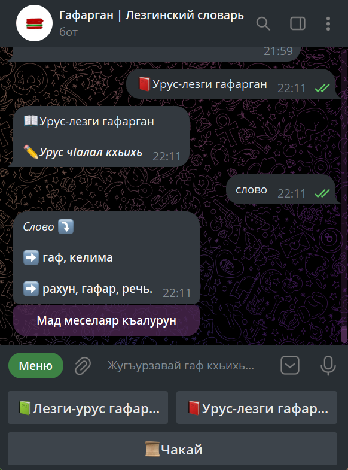
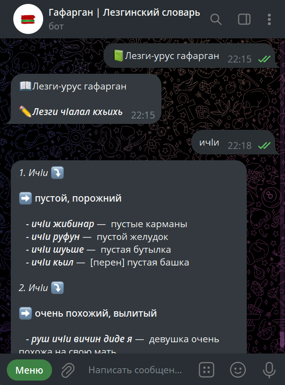
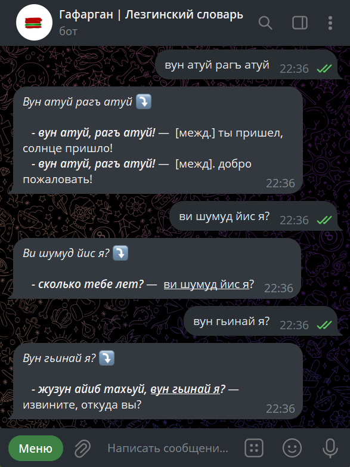
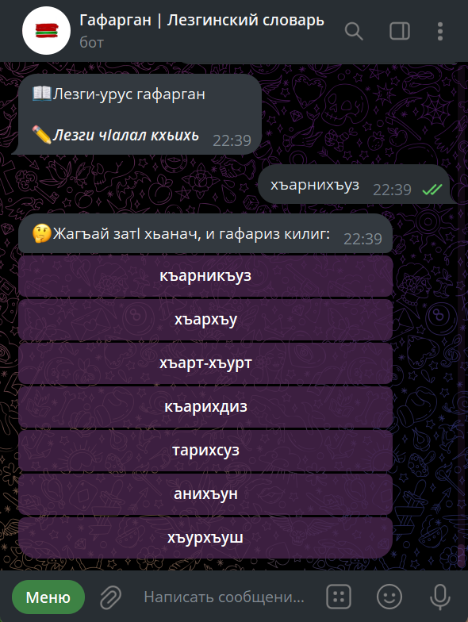
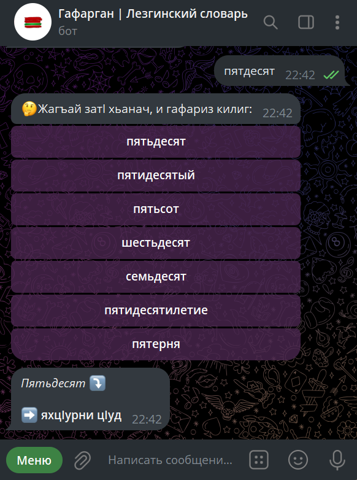

# Telegram Bot - <a href="https://t.me/GafarganBot">GafarganBot</a> 

- [Лезги](#лезги)
- [English](#english)
- [Русский](#русский)

---

# Лезги

<a href="https://t.me/GafarganBot">GafarganBot</a> - телеграм лезги гафарган-бот.
И ботдивай лезги чIалай урус чIалал ва урус чIалай лезги чIалал гафар таржума ийиз жезва. Идалай гъейри, сад садахъ галаз алакъалу са шумуд гаф жугъуриз жезва. Мадни, гъалатIар кваз кхьенвай гафарни жугъурун мумкин я.

Гафар жугъурун:

 

Сад садахъ галаз алакъалу са шумуд гаф жугъурун:

ГъалатIар квай гафар жугъурун:

 

---

# Инфо

Гафарганрин авторар👤:
- Лезги-урус гафарган📗 — Бабаханов М.Б.
- Урус-лезги гафарган📕 — Гаджиев М.М.

Чешме: <a href="https://github.com/LekiTech/data-sources">LekiTech</a>

---

# English

<a href="https://t.me/GafarganBot">GafarganBot</a> - is a Telegram bot of Lezgi dictionaries. This bot can search for translations of words from Lezgi to Russian and from Russian to Lezgi languages. In addition, it can search for word combinations. It can also find words entered with the spelling mistakes.

Search for words:

 

Phrase search:

Word search for misspelled words:

 

---

# Info

Authors of dictionaries👤:
- Lezgi-russian dictionary📗 — Babakhanov M.B.
- Russian-lezgi dictionary📕 — Gadzhiev M.M.

Source: <a href="https://github.com/LekiTech/data-sources">LekiTech</a>

---

# Русский

<a href="https://t.me/GafarganBot">GafarganBot</a> - телеграм-бот лезгинских словарей. Данный бот может искать переводы к словам с лезгинского на русский и с русского на лезгинский языки. Помимо этого, умеет искать словосочетания. Также, может найти слова, введенные с орфографическими ошибками.

Поиск слов:

 

Поиск словосочетаний (предложений):

Поиск слов с орфографическими ошибками:

 

---

# Инфо

Авторы словарей👤:
- Лезгинско-русский словарь📗 — Бабаханов М.Б.
- Русско-лезгинский словарь📕 — Гаджиев М.М.

Источник: <a href="https://github.com/LekiTech/data-sources">LekiTech</a>